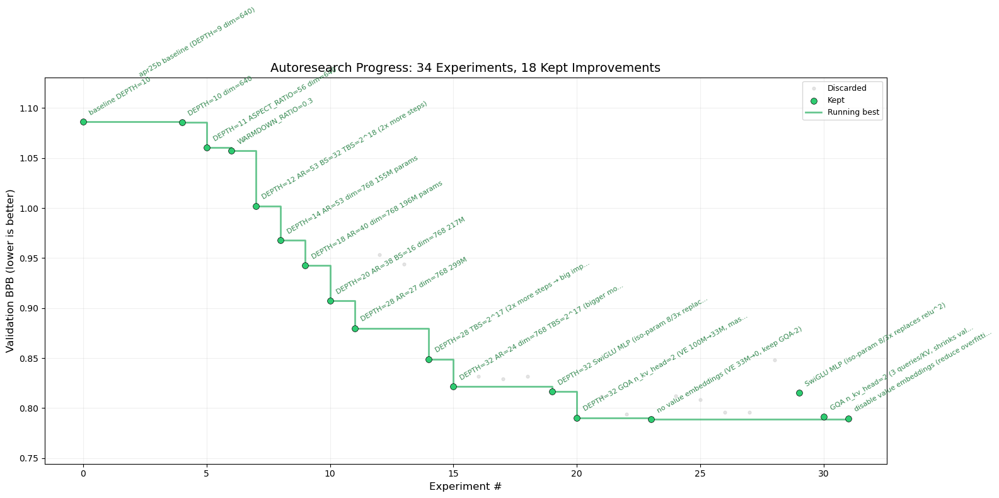

# Running an AI agent overnight on medical text

Last month I set up Andrej Karpathy's autoresearch to run overnight on medical pathology text. The idea: give an AI agent a training script, a fixed time budget, and a metric to optimise, then let it experiment while you sleep. By morning, you have dozens of experiments charted — architectural changes, learning rate schedules, batch size sweeps — that would take weeks to work through manually.

I am a third-year PhD student in Computational Biology, working on applying AI to inflammatory bowel disease (IBD). Alongside that, I am interested in multi-agent AI for scientific research — which led me to join Always Further as an AI Researcher in February 2026. Autoresearch is a concrete example of that: an AI agent running autonomously on a scientific workload. To demonstrate the setup, I used two publicly available medical corpora: IBD clinical case reports from the [MultiCaRe dataset](https://zenodo.org/records/10079370), and surgical pathology reports from [TCGA](https://data.mendeley.com/datasets/hyg5xkznpx/1) (The Cancer Genome Atlas). Medical text differs substantially from the general text most AI models are trained on — clinical reports are dense with abbreviations, disease-specific terminology, and structured formats that general web text does not adequately cover, making training on domain-specific text worthwhile.

But before I let it run unattended overnight, I needed to think about what I was actually leaving running on my machine.

---

## The problem

Autoresearch gives the AI agent full access to write code, run it, and repeat — in a loop, all night. The agent modifies `train.py`, kicks off a training job that runs for five minutes, checks if the results improved, and either keeps the change or reverts it.

The part that gave me pause: the training job it launches runs with full internet access, on a machine that also has my cloud credentials and SSH keys sitting on it. The agent will behave because it has been told to — but that is the only guarantee. If something goes wrong, there is nothing technically stopping it from accessing files it should not, or making network calls that look like normal traffic.

---

## Why nono

[nono](https://github.com/lukehinds/nono) is a tool that puts hard limits on what an AI agent is allowed to do at the operating system level — not just by telling it what not to do, but by making those actions technically impossible. Crucially, those limits also apply to anything the agent launches. So when autoresearch kicks off a training job, that job runs under the same restrictions as the agent itself.

I started with `nono learn`, which watches a real run and automatically figures out what files and network access the process actually needs. That gave a good starting point, but getting GPU training to work required a fair amount of trial and error — the GPU software stack touches a lot of places that are not obvious until something breaks.

The resulting setup restricts the agent to exactly what it needs:

| Without nono | With nono |
|---|---|
| Agent can read my cloud credentials and SSH keys | Blocked |
| Agent can write to any file on the machine | Write access limited to the project folder |
| Training job has full internet access | Network limited to the AI API and HuggingFace |
| No record of what the agent actually did | Full log of every file and network access |
| Instruction file can be quietly changed | Verified before every run |

---

## Two features worth highlighting

**Audit log.** There is a difference between what the agent committed to git and what it actually did. git only records what was saved. nono records everything — every file it opened, every network call it made, every access that was blocked. Useful for knowing exactly what happened during an overnight run.

**Instruction verification.** Each corpus has an instruction file that tells the agent what experiment to run. If that file gets accidentally changed between runs, the agent will run a different experiment than intended, with no warning. nono signs the instruction file before the first run and checks the signature at launch. If anything has changed, it refuses to start:

```
[nono] Checking attestation...
[nono] ABORT: attestation failed — program_ibd.md may have been tampered with.
```

---

## Getting started

One command starts the agent under enforcement:

```bash
exec nono run \
    --profile claude-code-autoresearch \
    --allow-gpu \
    --allow-cwd \
    --workdir "${AUTORESEARCH_DIR}" \
    -- claude --dangerously-skip-permissions
```

The agent does not know it is sandboxed. Nothing in the training setup needs to change. The profile is in the `profiles/` directory of [autoresearch-nono](https://github.com/Kexin-xu-01/autoresearch-nono), along with ready-to-use workloads for IBD, TCGA, and general web text. It will be published to the nono profile registry shortly.

---

## Example Results on IBD data



---

*Repo: [github.com/Kexin-xu-01/autoresearch-nono](https://github.com/Kexin-xu-01/autoresearch-nono)*
